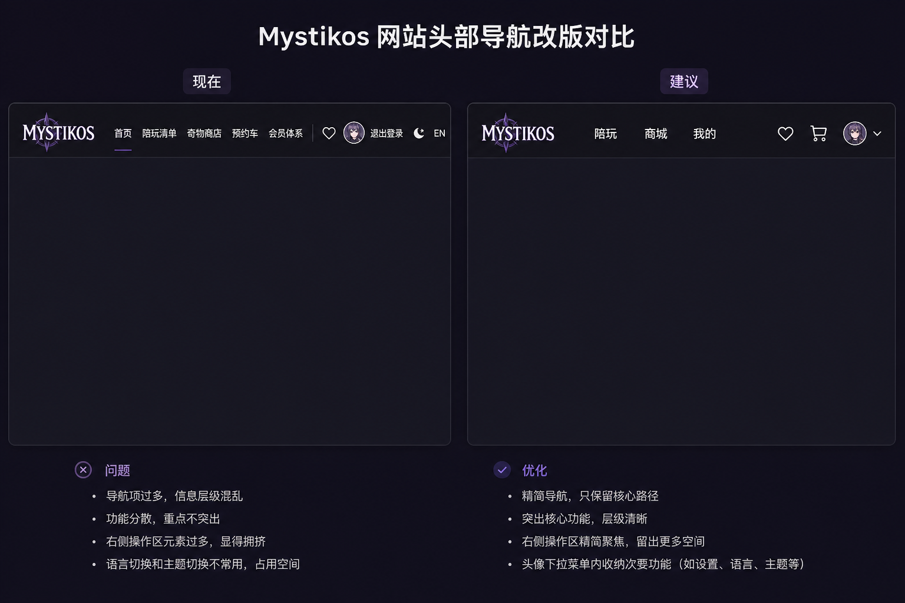
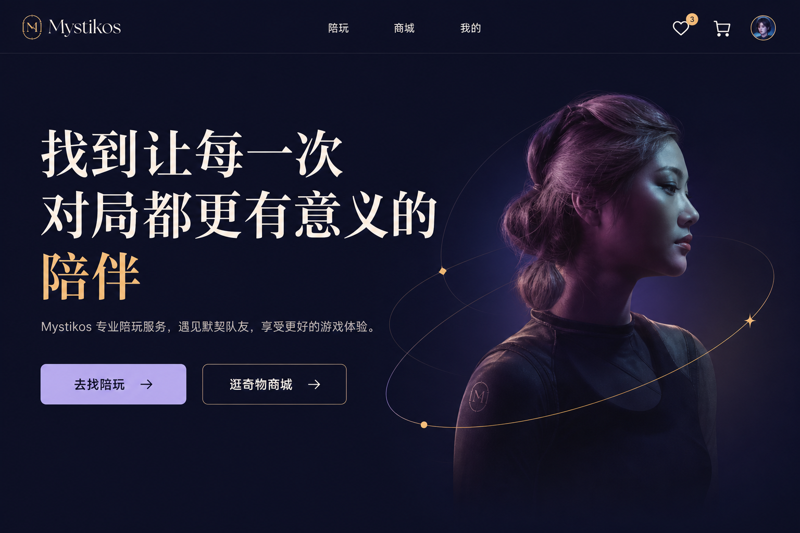
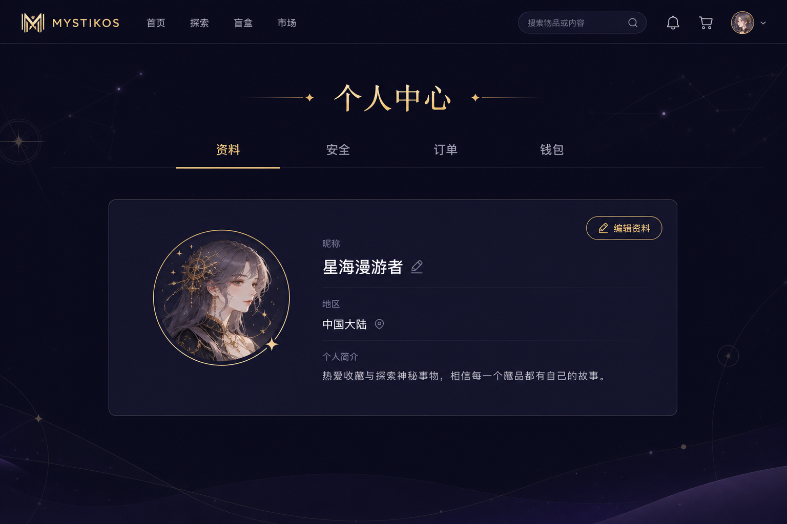

# Mystikos 前端体验收敛改版说明

> 目标：按设计示意收敛导航与首页信息密度，个人中心分 Tab 展示；**Logo 保持现状**；**不破坏既有接口绑定**。
>
> 建立日期：2026-09-03

## 设计示意（验收对照）

| 示意 | 文件 | 用途 |
| --- | --- | --- |
| 导航对比 | [design/mystikos-nav-compare.png](./design/mystikos-nav-compare.png) | 顶栏「现在 → 建议」 |
| 首页简化 | [design/mystikos-home-simplified.png](./design/mystikos-home-simplified.png) | 首屏双 CTA、导航三条 |
| 个人中心 Tab | [design/mystikos-profile-tabs.png](./design/mystikos-profile-tabs.png) | 资料 / 安全 / 订单 / 钱包 |

### 示意与产品差异说明

个人中心示意中若出现「盲盒、搜索栏」等与当前 Mystikos 产品不符的导航，**不以示意字面照搬**，以本文「设计对齐清单」与现有路由为准。示意只约束：**信息层级、顶栏收敛、首屏双 CTA、个人中心分 Tab**。

---

## 设计对齐清单（验收用）

### 顶栏（对标导航对比图「建议」侧）

- [x] Logo：继续使用现有 `BrandLogo`，不换图、不改品牌资源
- [x] 主导航仅三条：`陪玩` → `/companions`，`商城` → `/shop`，`我的` → `/profile`（未登录 → `/auth`）
- [x] 移除顶栏：`首页` 文案链、`会员体系` 锚点、独立「退出登录」文字按钮
- [x] 右侧保留：心愿单 ♡、点单车入口（登录可见）、头像
- [x] 主题 / 语言 / 退出：收入头像下拉，逻辑仍走现有 `toggleTheme` / `toggleLocale` / logout confirm
- [x] 心愿单抽屉、点单车路由、认证 Cookie/代理：**接口调用不变**

### 首页（对标首页简化图）

- [x] 首屏：品牌标题 + 一句说明 + 两个 CTA
  - 主 CTA「去找陪玩」→ `/companions`
  - 次 CTA「逛奇物商城」→ `/shop`
- [x] 不在首屏堆排行榜 / 会员 / 亲密度等未接真数据的强操作区块（已后置并标「预览」）
- [x] 精选陪玩卡「点单」须可到达真实页面（清单或详情），禁止空按钮
- [x] 商城 teaser CTA 仍指向 `/shop`
- [x] 不新增后端依赖；演示数据可保留但不得伪装成已持久化能力

### 个人中心（对标个人中心 Tab 图）

- [x] 同页 Tab：`资料` | `安全` | `订单` | `钱包`（`?tab=` query）
- [x] `资料`：现有资料展示/编辑 + 陪玩申请入口（`useProfileApi` / `useCompanionApplication` 不变）
- [x] `安全`：联系方式验证面板（邮箱 / 手机）；账号安全页仍可直接访问，安全 Tab 不再重复入口
- [x] `订单` / `钱包`：若仍为展示数据，须标注「示例 / 即将上线」，不得暗示接口已通
- [x] 游戏记录、成就等无接口模块：隐藏或收入「更多」，避免假可点
- [x] Logo / 顶栏规则与阶段 1 一致

---

## 硬性约束

| 项 | 要求 |
| --- | --- |
| Logo | 保持现状（`BrandLogo`） |
| 接口 | 不改 `useDemoAuth` / `useCommerceApi` / `useBookingApi` / `useProfileApi` / `useCompanionShowcaseApi` / `useCompanionApplication` / `useCommerceWishlist` / `auth-proxy` 的路径、参数、鉴权 |
| Auth | 登录注册加密与 Discord 流程不动 |
| 购物车模型 | 不合并商品车与点单车后端；仅理清入口与文案 |

---

## 实施阶段

### 阶段 1 — 顶栏收敛

- **状态**：已完成
- **文件**：`app/components/SiteHeader.vue`、`app/composables/useMystikos.ts`、`app/assets/css/main.css`
- **验收**：登录、心愿单拉数、点单车进入、退出确认正常；对照 `mystikos-nav-compare.png`「建议」侧

### 阶段 2 — 首页减负

- **状态**：已完成
- **文件**：`app/pages/index.vue`、`CompanionCard.vue`、文案/CSS
- **验收**：两 CTA 进真页面；空操作按钮清零；对照 `mystikos-home-simplified.png`

### 阶段 3 — 个人中心 Tab

- **状态**：已完成
- **文件**：`app/pages/profile.vue`（布局为主）
- **验收**：保存资料、头像、联系方式验证、陪玩申请流程与改前一致；对照 `mystikos-profile-tabs.png` 的 Tab 结构（非示意中的无关导航）

### 阶段 4 — 文案与文档

- **状态**：已完成
- **内容**：中文界面统一关键文案；更新 `README.md` 与本文清单
- **验收**：`npm test`、`npm run build`

---

## 本轮明确不做

- 不换 Logo / 不大改字体栈
- 不重做 auth 双栏（除非另开任务）
- 不接钱包 / 排行榜 / 亲密度新接口
- 不照搬设计图中与现产品不符的导航项（如盲盒、搜索栏）

---

## 变更记录

| 日期 | 内容 | 状态 |
| --- | --- | --- |
| 2026-09-03 | 建立改版说明、拷贝设计示意至 `docs/design/`、写出设计对齐清单 | 文档完成 |
| 2026-09-03 | 阶段 1–4：顶栏收敛、首页减负、个人中心 Tab、文案与文档 | 已完成 |
| 2026-09-03 | 全站字体层级重建（页脚 / 眉题 / 清单说明等） | 已完成 |
